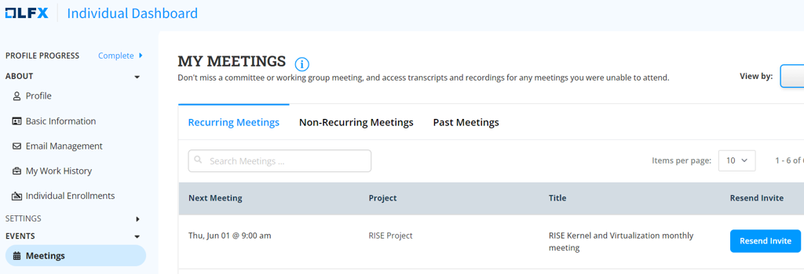
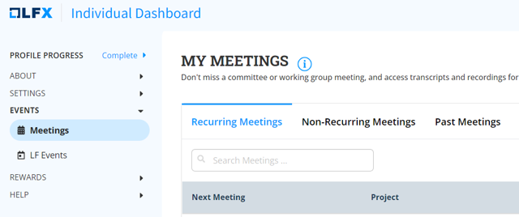
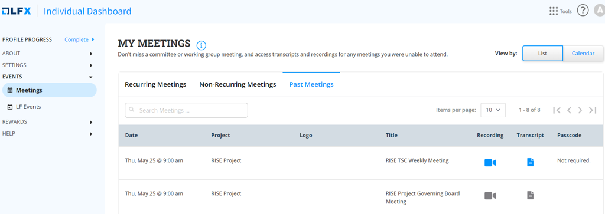

# Firmware WG - Monthly Meetings

The Firmware Working Group will meet once in a month (First Wednesday at 8AM PST) but encourage members to actively discuss things over the mailing list. There will be separate slide deck for each meeting and a template will be created for the meeting. The members can update the slides if they have an agenda to discuss and notify the group at least a week before the meeting.

Slides: See [Monthly Meetings](https://drive.google.com/drive/folders/1LW4Jw_JcX4CZosjSau4-U5MOL0M8i4is?usp=sharing) Slides folder

## Missing Invites

Login to [https://openprofile.dev/my-calendar](https://openprofile.dev/my-calendar).

If you have been added to a meeting, you should see this listed. If this is a non-recurring meeting, you'll have to click on **Non-Recurring Meetings**.

You can then click **Resend Invite**. Check your spam folder if you still don't see it.

If you don't see a meeting, reach out to the LF Product Manager (listed on the [RISE Technical Steering Committee](https://lf-rise.atlassian.net/wiki/spaces/HOME/pages/8585584) page).

## Getting Recordings

Login to [https://openprofile.dev/my-calendar](https://openprofile.dev/my-calendar).

Now click on **Past Meetings**.

Click the blue recording and transcript icons to get the video and audio transcription, respectively.
